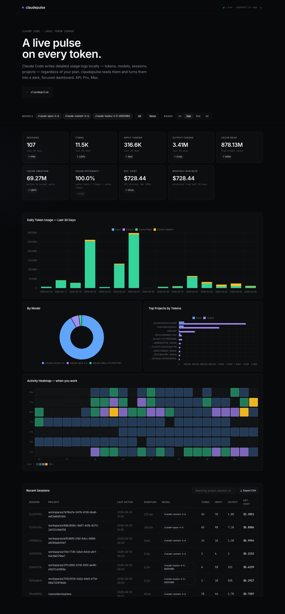

# claudepulse

[](LICENSE)
[](https://claude.ai/code)
[](https://pypi.org/project/claudepulse/)

**A live pulse on your Claude Code usage.** Tokens, sessions, cost — in a dark dashboard that actually reads well.

Claude Code writes detailed usage logs locally — token counts, models, sessions, projects — regardless of your plan. claudepulse reads those logs and turns them into charts and cost estimates. Works on API, Pro, and Max plans.



---

## What this tracks

Works on **API, Pro, and Max plans** — Claude Code writes local usage logs regardless of subscription type. claudepulse reads them and gives you visibility the official UI does not.

Captures usage from:
- **Claude Code CLI** (`claude` command in terminal)
- **VS Code extension** (Claude Code sidebar)
- **Dispatched Code sessions** (sessions routed through Claude Code)

**Not captured:**
- **Cowork sessions** — these run server-side and do not write local JSONL transcripts

---

## Requirements

- Python 3.8+
- No third-party packages — uses only the standard library (`sqlite3`, `http.server`, `json`, `pathlib`)

> Anyone running Claude Code already has Python installed.

## Install

Pick one. All three give you a working `claudepulse` command.

### 1. One-liner installer (macOS / Linux) — recommended

```
curl -fsSL https://raw.githubusercontent.com/ColdDesertLab/claudepulse/main/install.sh | bash
claudepulse
```

Clones to `~/.claudepulse`, drops a launcher in `~/.local/bin/claudepulse`, and auto-pulls `origin/main` on every run. Disable auto-update with `CLAUDEPULSE_NO_UPDATE=1`. Override paths with `CLAUDEPULSE_HOME` and `CLAUDEPULSE_BIN`.

### 2. pipx (cross-platform)

```
pipx install claudepulse
claudepulse
```

Or straight from GitHub:

```
pipx install git+https://github.com/ColdDesertLab/claudepulse
```

Upgrade with `pipx upgrade claudepulse`.

### 3. Manual clone (no install)

```
git clone https://github.com/ColdDesertLab/claudepulse
cd claudepulse
python3 cli.py dashboard      # macOS / Linux
python  cli.py dashboard      # Windows
```

No third-party packages required — pure Python stdlib.

---

## Usage

```
claudepulse                # scan + open browser dashboard at http://localhost:8080
claudepulse scan           # scan JSONL files and update database
claudepulse today          # today's usage summary by model
claudepulse stats          # all-time statistics
claudepulse --version
```

The scanner is incremental — it tracks each file's path and modification time, so re-running `scan` is fast and only processes new or changed files.

---

## Design

The dashboard uses a Linear-inspired dark theme — near-black canvas (`#08090a`), semi-transparent white borders, Inter Variable at weight 510, indigo-violet accent for interactive elements only. Built to be read for long stretches.

---

## How it works

Claude Code writes one JSONL file per session to `~/.claude/projects/`. Each line is a JSON record; `assistant`-type records contain:
- `message.usage.input_tokens` — raw prompt tokens
- `message.usage.output_tokens` — generated tokens
- `message.usage.cache_creation_input_tokens` — tokens written to prompt cache
- `message.usage.cache_read_input_tokens` — tokens served from prompt cache
- `message.model` — the model used (e.g. `claude-sonnet-4-6`)

`scanner.py` parses those files and stores the data in a SQLite database at `~/.claude/usage.db`.

`dashboard.py` serves a single-page dashboard on `localhost:8080` with Chart.js charts (loaded from CDN). It auto-refreshes every 30 seconds and supports model filtering with bookmarkable URLs.

---

## Cost estimates

Costs are calculated using **Anthropic API pricing as of April 2026** ([claude.com/pricing#api](https://claude.com/pricing#api)).

**Only models whose name contains `opus`, `sonnet`, or `haiku` are included in cost calculations.** Local models, unknown models, and any other model names are excluded (shown as `n/a`).

| Model | Input | Output | Cache Write | Cache Read |
|-------|-------|--------|------------|-----------|
| claude-opus-4-6 | $6.15/MTok | $30.75/MTok | $7.69/MTok | $0.61/MTok |
| claude-sonnet-4-6 | $3.69/MTok | $18.45/MTok | $4.61/MTok | $0.37/MTok |
| claude-haiku-4-5 | $1.23/MTok | $6.15/MTok | $1.54/MTok | $0.12/MTok |

> **Note:** These are API prices. If you use Claude Code via a Max or Pro subscription, your actual cost structure is different (subscription-based, not per-token).

---

## Files

| File | Purpose |
|------|---------|
| `scanner.py` | Parses JSONL transcripts, writes to `~/.claude/usage.db` |
| `dashboard.py` | HTTP server + single-page HTML/JS dashboard |
| `cli.py` | `scan`, `today`, `stats`, `dashboard` commands |
| `install.sh` | One-liner installer + auto-updating launcher |
| `pyproject.toml` | Packaging metadata for pip / pipx / PyPI |

---

## License

MIT — see [LICENSE](LICENSE).
